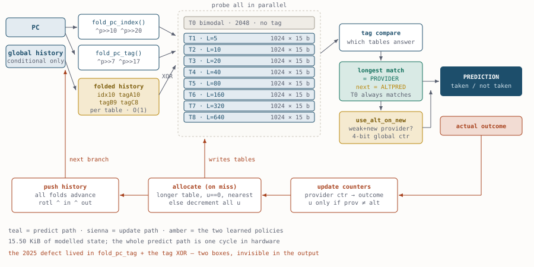
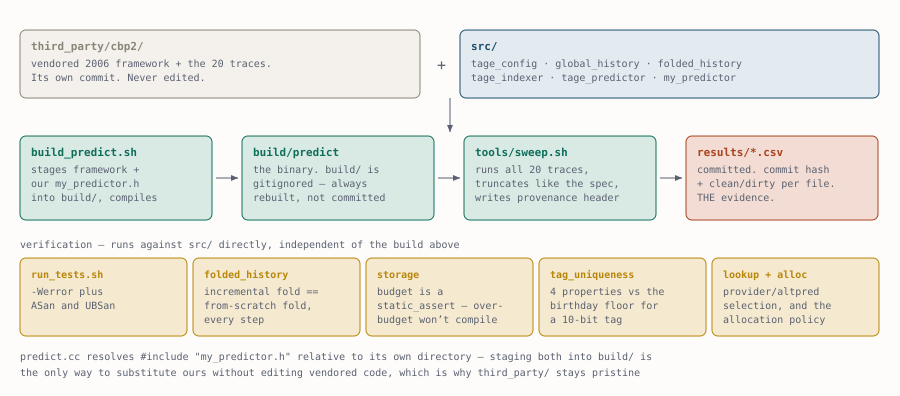

# TAGE Branch Predictor

A TAgged GEometric-history-length branch predictor built against the CBP-2
framework, rebuilt from the published design with a measured baseline, a
storage budget enforced at compile time, and a test suite that verifies the
parts whose correctness is invisible in the output.

**6.305 → 3.922 MPKI, a 37.8% improvement over the reference baseline, better
on all 20 of 20 traces individually, at 15.50 KiB against the baseline's 8 KiB.**

---

## Results

Every row is a build from this tree, measured by `tools/sweep.sh` on the same
20 CBP-2 traces. Each CSV in `results/` records the commit hash and clean/dirty
state of the tree that produced it.

| configuration | storage | MPKI | vs baseline | csv |
|---|---:|---:|---:|---|
| stock gshare (reference baseline) | 8.00 KiB | 6.305 | — | `stock-gshare.csv` |
| bimodal only, allocation disabled | 9.50 KiB | 9.651 | +53.1% | `tage-noalloc.csv` |
| TAGE core, 4 tables, a=3, L<=135 | 9.50 KiB | 4.276 | −32.2% | `tage-core.csv` |
| TAGE core, 8 tables, a=2, L<=640 | 16.00 KiB | 4.140 | −34.3% | `tage-core-8t.csv` |
| ...bimodal reduced to 2048 entries | 15.50 KiB | 4.184 | −33.6% | `tage-8t-bim2k.csv` |
| **+ use_alt_on_newalloc** | **15.50 KiB** | **3.922** | **−37.8%** | `tage-8t-usealt.csv` |

Per trace, baseline against final:

| trace | gshare | TAGE | | trace | gshare | TAGE |
|---|---:|---:|---|---|---:|---:|
| 164.gzip | 12.473 | 10.769 | | 213.javac | 2.267 | 1.235 |
| 175.vpr | 13.415 | 9.604 | | 222.mpegaudio | 2.188 | 1.218 |
| 176.gcc | 11.254 | 5.288 | | 227.mtrt | 2.657 | 0.557 |
| 181.mcf | 15.837 | 10.819 | | 228.jack | 3.033 | 0.812 |
| 186.crafty | 5.837 | 3.612 | | 252.eon | 1.807 | 0.425 |
| 197.parser | 10.008 | 6.877 | | 253.perlbmk | 2.554 | 0.362 |
| 201.compress | 7.831 | 6.210 | | 254.gap | 3.926 | 1.985 |
| 202.jess | 1.562 | 0.524 | | 255.vortex | 1.222 | 0.235 |
| 205.raytrace | 2.756 | 0.517 | | 256.bzip2 | 0.094 | 0.045 |
| 209.db | 3.909 | 2.521 | | 300.twolf | 21.489 | 14.831 |

The baseline is not self-selected: the course assignment publishes the stock
predictor's output for all 20 traces and states an average of 6.305. All 20
values were reproduced exactly before any of this was built. See
`docs/ground-truth.md`.

---

## Design

**Geometry.** A tagless bimodal table plus 8 tagged tables at geometrically
increasing global-history lengths, `L(i) = round(a^(i-1) * L(1))` with
`L(1) = 5` and `a = 2`: **5, 10, 20, 40, 80, 160, 320, 640**. Every table is
probed in parallel; the tag-matching table with the longest history provides
the prediction, the next-longest is the altpred.

Geometric rather than linear spacing because the distribution of useful
correlation distances is heavily skewed toward short ones. No individual
length has to be well chosen — allocation migrates each branch to whichever
table suits it, so the series only has to *cover* the distribution.

**Indexing.** History longer than the index width is XOR-compressed by a folded
register maintained in O(1) per branch:

    F(H') = rotl(F(H)) XOR incoming@0 XOR outgoing@(L mod W)

Constant time regardless of L, which is why a 640-bit history costs the same
per branch as a 5-bit one, and therefore why every table can afford its own
folds. Verified against a from-scratch recomputation at every step.

**Tags.** A tag answers one question: *was this entry allocated by the
(PC, history) context I am in right now?* It is a hash of the folded PC and
three folds of this table's history, at widths 10/9/8 shifted 0/1/2.

**Allocation.** On a misprediction, allocate into a table with longer history
than the provider, preferring entries with `u == 0`, biased toward the nearest
longer table so the history requirement grows gradually. When no candidate has
`u == 0`, nothing is evicted — every candidate's `u` is decremented instead.
A proven entry is not traded for a speculative one; sustained pressure lowers
the bar over time while transients disturb nothing. `u` counters are halved
every 512K conditional branches.

**use_alt_on_newalloc.** A 4-bit global counter deciding whether a weak,
newly-allocated provider should be trusted over its altpred. Worth 6.3% on its
own — see below.

---

## Two defects found by measurement

Both are in the tag function, and neither would crash, warn, or produce
implausible output. A broken tag still yields believable MPKI. That is the
argument for testing the parts whose correctness is invisible.

**1. Even fold counts destroy a bit of tag entropy.** For any width `w`, every
history bit lands in exactly one position of `fold_w`, so
`parity(fold_w(H)) == parity(H)` regardless of `w`. XOR an *even* number of
folds and the parities cancel: the result is confined to the even-parity
subspace, half the tag values become unreachable, and same-PC cross-context
collisions double. Measured **0.00198** against a 0.00098 floor with the
conventional two-fold construction; **0.00091** with three folds.

**2. Index and tag drawing on the same PC bits.** With both taking the low bits
of `pc>>2`, an index collision *implied* a tag collision at the same history —
the tag contributed nothing to cross-PC discrimination. A test sampling random
PC pairs reported a healthy rate for the wrong reason, because only ~1/1024 of
random pairs collide in the index at all. Measuring the **conditional** rate
read **1.00000**. Fixed by folding the full address with different shift
schedules for index and tag; now 0.00065.

**And one non-defect worth recording.** Doubling the tables from 4 to 8 and
adding 68% storage bought only 3.2%, and made 8 of 20 traces *worse*. Capacity
was not the constraint — a missing policy was. Newly allocated entries carry no
evidence, yet the longest-match rule let them override well-trained
shorter-history entries, and the damage *scaled with table count* because more
tables means more allocation. A single 4-bit counter recovered four of the five
regressions to below their 4-table values.

---

## Verification

`tests/run_tests.sh` builds every test under `-Wall -Wextra -Werror` with
address and undefined-behaviour sanitizers.

| test | what it establishes |
|---|---|
| `folded_history_test` | incremental fold equals from-scratch recomputation at every step, over 20000 branches, for six (length, width) pairs spanning `len < width` and `len > width` |
| `storage_test` | reports the storage breakdown; the budget is a `static_assert`, so an over-budget configuration does not compile |
| `tag_uniqueness_test` | four tag properties, gated at 3x the birthday floor for a 10-bit tag |
| `lookup_test` | provider/altpred selection, and that an entry belongs to a context rather than to a PC |
| `allocation_test` | allocation targets longer tables, prefers `u == 0`, never evicts a proven entry, and moves `u` only on provider/altpred disagreement |

The storage budget is self-imposed. The assignment sets no limit but requires
area overhead to be explained, so 16 KiB was chosen as 2x the baseline's
logical state — beating a baseline by outspending it proves nothing. All
control state is counted: an earlier configuration sat at exactly 100.0% of
budget because the global counters had been omitted from the accounting, which
is the same class of error this project exists to avoid.

---

## Reproducing

Requires a POSIX environment with `g++`, `make` and `bzip2`.

    tests/run_tests.sh                        # build and run all tests
    tools/build_predict.sh                    # assemble build/predict
    tools/sweep.sh build/predict third_party/cbp2/traces my-run

The sweep writes `results/my-run.csv` with the commit hash and clean/dirty
state in the header. Averages are truncated at three decimals to match the
assignment's `dc`-based reference script, with full precision recorded
alongside.

`third_party/cbp2/` is the CBP-2 (2nd Championship Branch Prediction)
infrastructure, released 2006 by Daniel A. Jiménez, vendored unmodified.
`tools/build_predict.sh` stages the framework sources and this project's
headers into `build/` so the framework's sample predictor is substituted
without editing the vendored tree.

---

## Scope and future work

This is a **TAGE core**. It is not L-TAGE, which is TAGE plus a loop predictor,
and it is not TAGE-SC-L, which adds a statistical corrector. Getting that
lineage right matters: TAGE (tagged geometric core) → L-TAGE (+ loop predictor)
→ TAGE-SC-L (+ statistical corrector).

Not built, in rough order of expected value:

- **Loop predictor.** Constant-trip-count loops are TAGE's systematic blind
  spot: predicting the exit from global history alone would need an entry per
  iteration position. A tagged table holding a trip count and a confidence
  field does it exactly, in a few bytes. `300.twolf` at 14.831 is the obvious
  target.
- **Statistical corrector.** For branches that are statistically biased but not
  context-determined, TAGE chases noise by allocating ever-longer histories
  that never converge. Signed counters over several history flavours flip the
  prediction when they strongly disagree.
- Per-table tag widths and entry counts, currently uniform.
- A budget sweep: this configuration was not searched, only reasoned about.

**On provenance.** An earlier implementation of this predictor, written for a
course, reported results that could not be reproduced from its source. That is
why this repository measures its baseline before building anything, keeps every
result in a committed CSV stamped with the commit that produced it, and tests
the tag function rather than trusting that it looks right. No figure appears
here that a file in `results/` did not produce.
